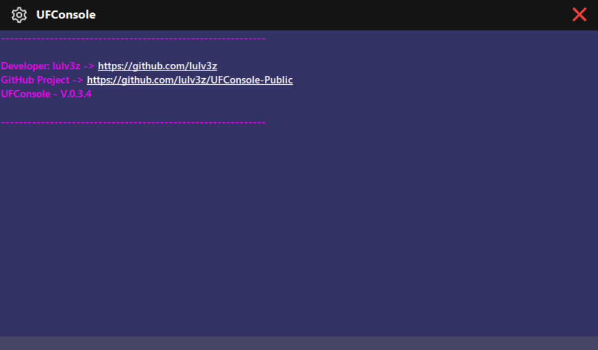
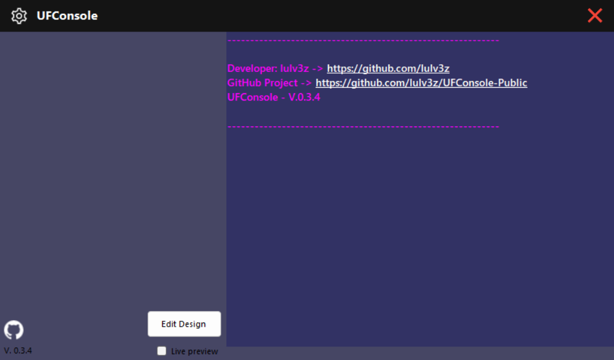
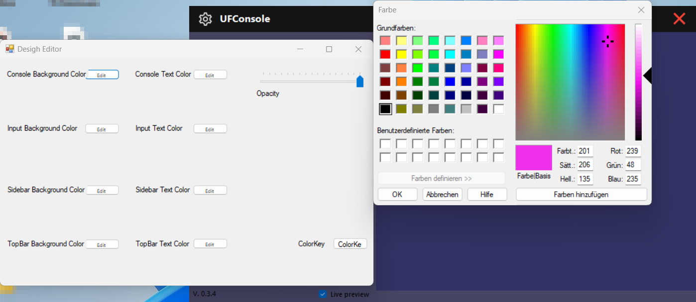
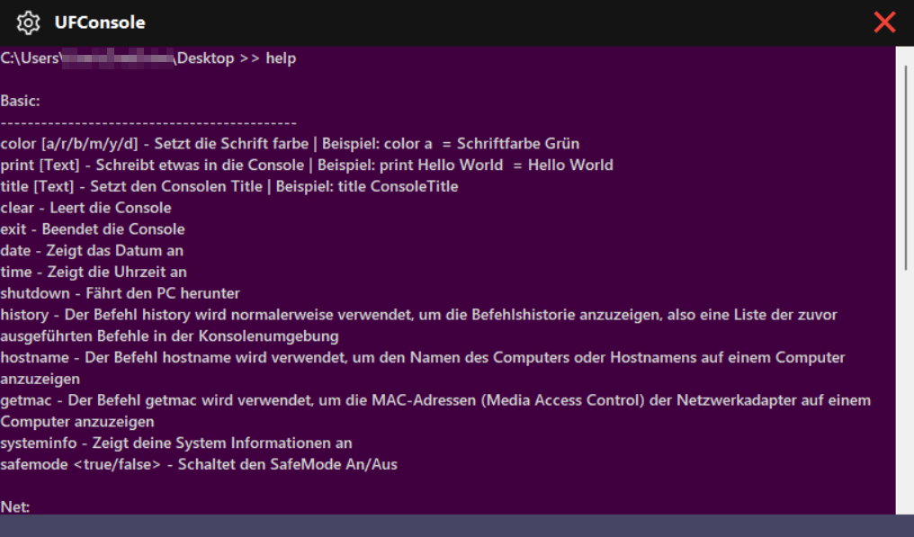

<!-- PROJECT LOGO -->
 

<h3 align=\"center\">UFConsole</h3>

UFConsole is a user-friendly and powerful console application designed to simplify interaction with the file system and operating system. The application offers a variety of useful commands that allow users to manage files, display directory structures, monitor processes, retrieve system information, and much more.
  
<a href="https://github.com/lulv3z/UFConsole-Public"><strong>Explore the docs »</strong></a>
  
  
<a href="https://github.com/lulv3z/UFConsole-Public/releases/latest">Download</a>
·
<a href="https://github.com/lulv3z/UFConsole-Public/blob/master/CHANGELOG.md">Changelog</a>
·
<a href="https://github.com/lulv3z/UFConsole-Public/issues/new/choose">Report Bug</a>
·
<a href="https://github.com/lulv3z/UFConsole-Public/issues/new/choose">Request Feature</a>

 

## About The Project   
UFConsole (User FriendlyConsole) is a user-friendly and versatile console application that aims to simplify interactions with the file system and operating system. This console application provides a wide range of useful commands that allow users to manage files, display directory structures, retrieve system information, execute processes, and much more.
<!-- [![Product Name Screen Shot][product - screenshot]](https://example.com) --->  

### Available Commands
- `clear`: Clear the console screen.
- `print`: Print a message to the console.
- `title`: Set the title of the console window.
- `ls`: List files and directories in the current directory.
- `cd`: Change the current directory.
- `color`: Change the console foreground color.
- `getmac`: Display MAC addresses of network adapters
- `hostname`: Display the computer's hostname.
- `history`: Display the command history.
- `type`: Display the content of a text file.
- `attrib`: Display file or directory attributes.
- `tasklist`: Display a list of running processes (with optional search).
- `taskkill`: Terminate a running process by PID or process name.
- `systeminfo`: Display system information.
- `ping`: Send ICMP echo requests to a specified host.
- `ipconfig`: Display IP configuration information.
- `start`: Open a file or URL with the default program.
- `shutdown`: Shutdown or restart the computer.
- `mkdir`: Create a new directory.
- `copy`: Copy files or directories.
- `move`: Move files or directories.
- `rename`: Rename a file or directory.
- `tree`: Display the folder structure in a tree-like format.
- `date`: Display the current date.
- `time`: Display the current time.
- `safemode`: Enable or disable safe mode for risky operations.
- `deltemp`: Delete the contents of the temporary folder.
- `delfolder`: Delete a selected folder and its contents.
- `delfile`: Delete a selected file.
- `copyfolder`: Copy a folder and its contents to a new location.
- `copyfile`: Copy a file to a new location.
- `movefolder`: Move a folder and its contents to a new location.
- `movefile`: Move a file to a new location.
and more...

## Examples

- Change directory:
`cd C:\Users\YourUsername\Documents`
- List files and directories in the current directory:
`ls`
- Display system information:
`systeminfo`
- View the content of a text file:
`type C:\path\to\file.txt`
- Delete a folder:
`delfolder C:\path\to\folder`

### preview

## Additional Notes

- Use the help command to display the list of available commands with brief descriptions.
- To exit the UFConsole, use the exit command.
<!--ABOUT THE PROJECT --> 

## Contributing

Contributions to UFConsole are welcome! Feel free to open issues and submit pull requests for bug fixes, improvements, or new features.

